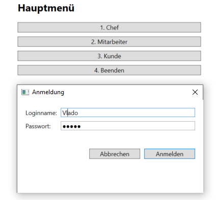
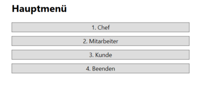
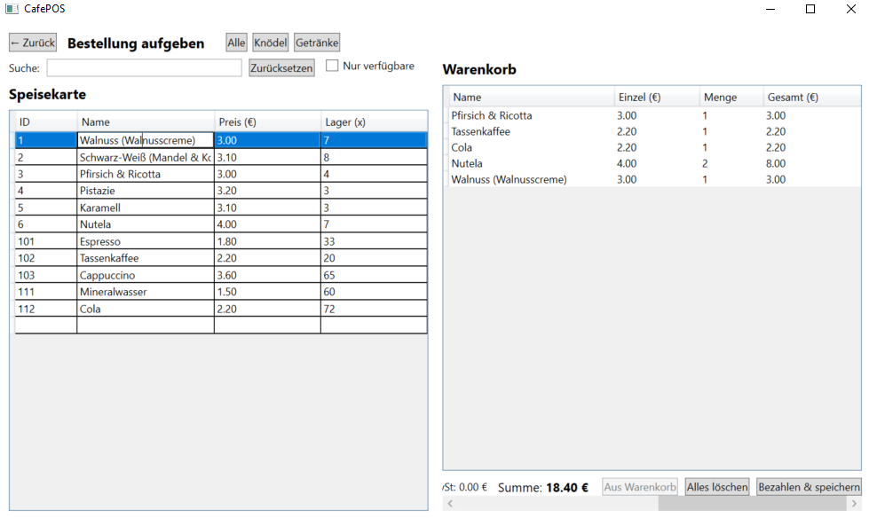

 CafePOS 🧾

Ein einfaches **Kassensystem** als WPF-Desktop-App in **C# / .NET**.  
Fokus: **MVVM**, **Datenbindung**, klare **Navigation** und ein übersichtlicher GUI-Flow.

## ✨ Funktionen
- **Login** mit Benutzern & Rollen (In-Memory)
- **Hauptmenü** mit Navigation (Customer, Produkte, Bestellungen)
- **Produkt-/Speisekarte** mit Datenbindung
- **Bestellverwaltung** (Positionen hinzufügen/ändern)
- **Beleg-Erzeugung** (Datei-Service vorbereitet)
- Saubere Schichten: `CafePOS.Domain` (Modelle & Services) und `CafePOS.Wpf` (Views, ViewModels)

## 🧱 Architektur
- **MVVM** (ViewModels, Commands, ObservableObject)
- **NavigationService** (aktuelles ViewModel im `ShellWindow`)
- **Domain-Modelle**: `Artikel`, `Benutzer`, `Beleg`, `Bestellposition`, `Rolle`
- **Services**: `SpeisekarteService`, `SpeisekarteDateiService`, `BelegDateiService`

## 🛠️ Tech-Stack
- **.NET** (Windows)
- **WPF** (XAML), **C#**

## 🚀 Start (Lokal)
1. .NET SDK installieren (Version wie im `.csproj`).
2. Lösung `CafePOS.sln` in **Visual Studio** öffnen.
3. Startprojekt auf **CafePOS.Wpf** setzen → **F5**.

## 📸 Screenshots

**Startbildschirm**

**Hauptmenü**

**Bestellung**

## 📂 Projektstruktur (Auszug)
